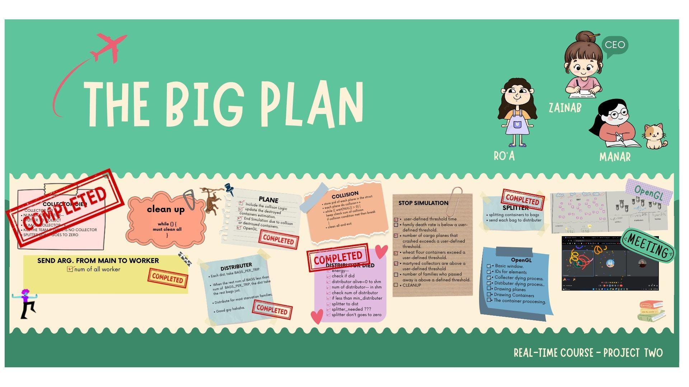

# Interprocess Communication Techniques under Linux
---

---

## Objective
This project simulates the distribution of wheat flour aid in northern Gaza under challenging conditions. It uses multiple interprocess communication techniques to manage a multi-processing environment where various processes such as cargo planes dropping aid, relief workers collecting and distributing flour, and hazards from hostile forces interact in real-time.

---

## How to run

- Clone the repository to your local machine.
- Ensure GCC and Make are installed on your system. Optionally, if you use OpenGL for visual representation, ensure it is installed.
- Compile and run plane.c and main.c in separate terminals. Follow the steps below:

1. Open a terminal and navigate to the directory containing your source files.
2. compile the project using the make command "make"
3. In the same terminal, run plane program
4. Open a new terminal and navigate to the same directory."./plane"
5. In the new terminal, run the compiled main program "./main"

---

## Configuration File Input
The simulation parameters are configurable through a text file (`config.txt`). You can modify the following parameters:

- `num_planes`
- `containers_per_plane_min`
- `containers_per_plane_max`
- `drop_frequency_sec`
- `refill_time_min`
- `refill_time_max`
- `num_collectors_teams`
- `collecter_per_team`
- `num_of_splitter`
- `num_of_distributer`
- `distributer_bags`
- `min_distributer`
- `app_period`
- `death_threshold`
- `damage_planes`
- `max_containers`
- `collec_workers_martyred`
- `distrib_workers_martyred`
- `family_death_threshold`
- `simulation_time`
- `min_death_rate`

Include this file as an argument when running the simulation:

---

## Languages and Tools

-    

 

